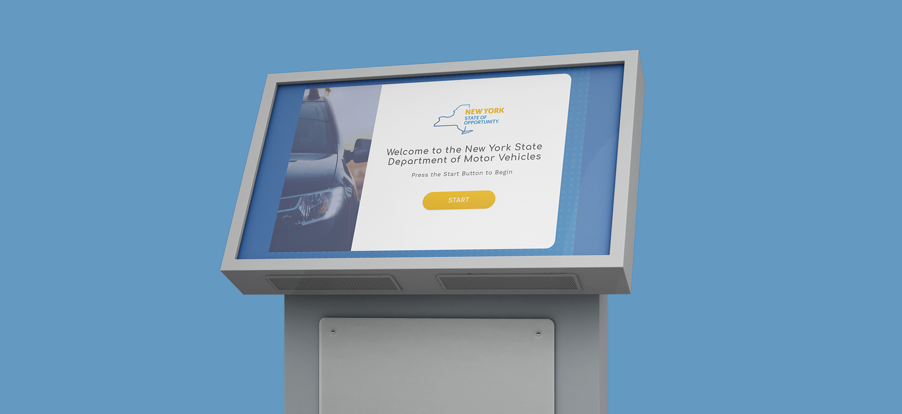

[back](./)

# DMV Form Redesign

## Problem and Purpose
No one likes going to the DMV. You sit in a room full of people, waiting for hours, to complete a task that, at times, will only take a few minutes. The current DMV form to register a vehicle is long and overwhelming and there is a lot of information that a person might not even to fill out. The process can be error-prone at times as users might not know what information they need to bring or even not what information is even required.

In this project, I focused on steamlining and simplfying the current process of registering a vehicle. I also explored different options to fill out a form, instead of the traditional pen and paper method, that will hopefully speed up your visit to the DMV.

## The Process

### The Beginning
My first step for the project was auditing the current process of registering a vehicle. The current form is split into five main sections: basic information, vehicle information, owner information, more vehicle information, and certification. Within each section are details you must fill out, but not all sections and details apply to every user. For example, there are spaces to fill out if you are registering a commercial vehicle, but tat isn't applicable for most people who are only registering a personal vehicle. Another issue to note is the VIN number. A quick survey of my fellow college-aged classmates showed that not many people knew what a VIN number was or where to locate it on their vehicle. Finally, I felt that there is a better way to organize the information to make it more intuitive. For instance, the two sections regarding vehicle information are separated by an unrelated section about ownership.

One of the issues, I wanted to solve was to streamline the process for filling out theses forms. I initially had two ideas for this; one being an online form to fill out and the other a kiosk. Experience-wise, and online form would have been the best solution as a person would never have to leave the comfort of their own home and ideally have all the information needed on hand, however, I have never designed a solution for a kiosk interface before and thought it would a challenging experience for myself.

### The Concept
During development of this project I had to be extremely aware of my target audience. Everyone visits a DMV, from teenagers applying for a permit, to elderly adults renewing their license. I needed my design to work for all individuals, each with their own respective needs and frustrations.  A few design choices, that I knew were necessary were large buttons/text and progress bars. Large buttons and text would be helpful for individuals with low vision and elderly people read text. Progress bars would benefit everyone as they will easily identify their progress into the form and encourage them to finish the task at hand.  

### The Iterations
During development of this project I had to be extremely aware of my target audience. Everyone visits a DMV, from teenagers applying for a permit, to elderly adults renewing their license. I needed my design to work for all individuals, each with their own respective needs and frustrations. Through, user testing,  narrowed my design to what is pictured below. Information is spread out over screens to not confuse users, a progress bar is prominently displayed, and copy is friendly, inviting, and simple for easy comprehension.

## The Product
This was an interesting project to take on and proved to be quite a challenge, especially due to the time restraints I put on myself. I, mostly, adhered to the New York State design guide, and created a more intuitive and user friendly was for users to register a vehicle. 

If I were to continue working on this project, I would definitely include accessibility features. I set out to design a solution that would make the process easier for everyone and I didn't include even the most basic of accessibility features, like a zoom function, text-to-speech, etc.  

Overall, I solved the main issues I wanted to, and created a solid alternative to the tedious task of filling out forms.

[back](./)