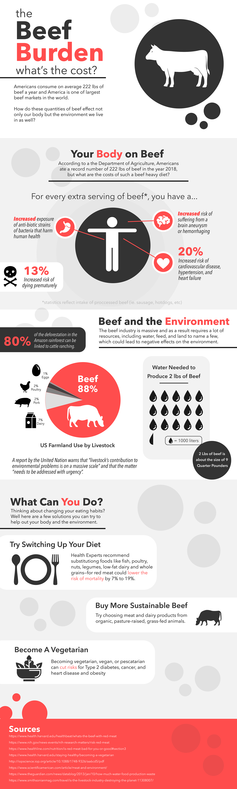
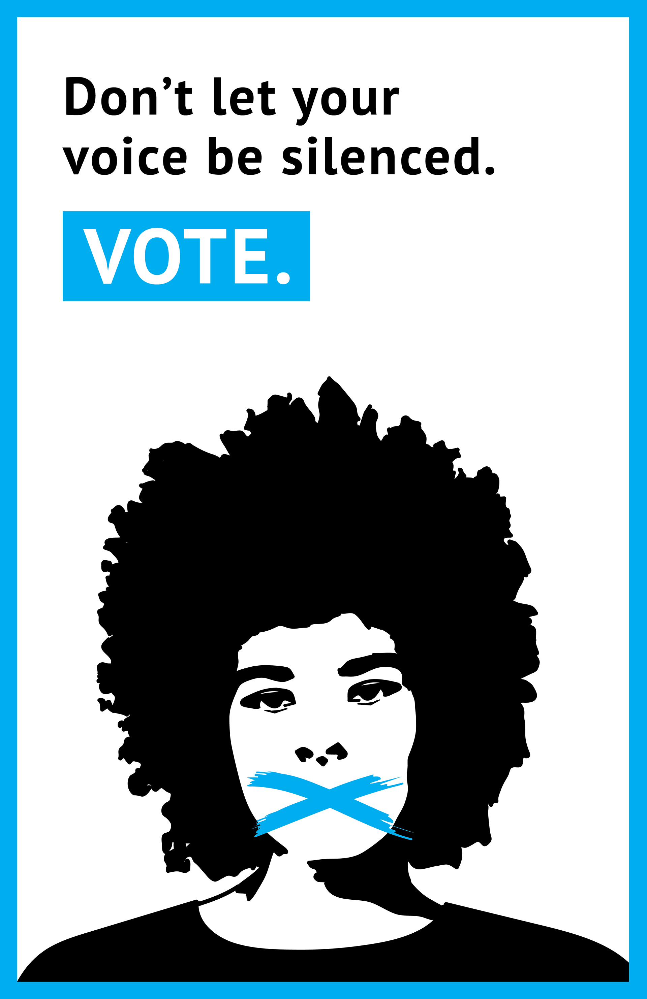
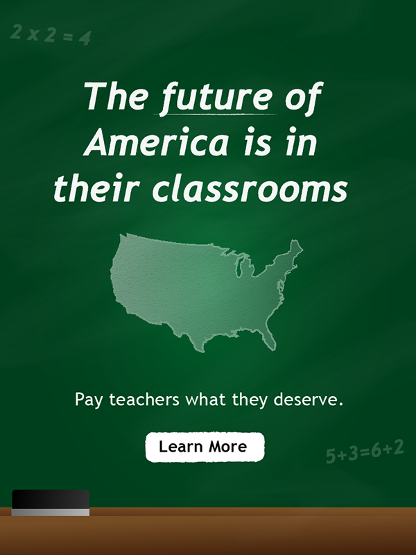

# Assorted Work
A collection of various visual design projects I have created

## Beef Infographic
I was tasked with creating an info-graphic to inform readers about the cost of eating excessive amounts of beer. I separated the graphic into smaller chucks to make it easier to read, and choose a simply color palette to allow the message to be at the center of attention.

## Vote Poster
Many young people believe that their voice doesn't matter in the grand scheme of things when it comes to political matters. Young people are the least likely to vote in elections, even though theses elections dictate and impact their futures. This poster was created to empathize with a younger audience to convince them to vote in their local and national elections. 

## Teacher's Pay PSA
American public school teachers are often underpaid and overworked. It's their responsibility to educate the next generation, but they are dangerously under-supported. I created this digital PSA to inform people about how poorly funded teachers are.

[back](../)