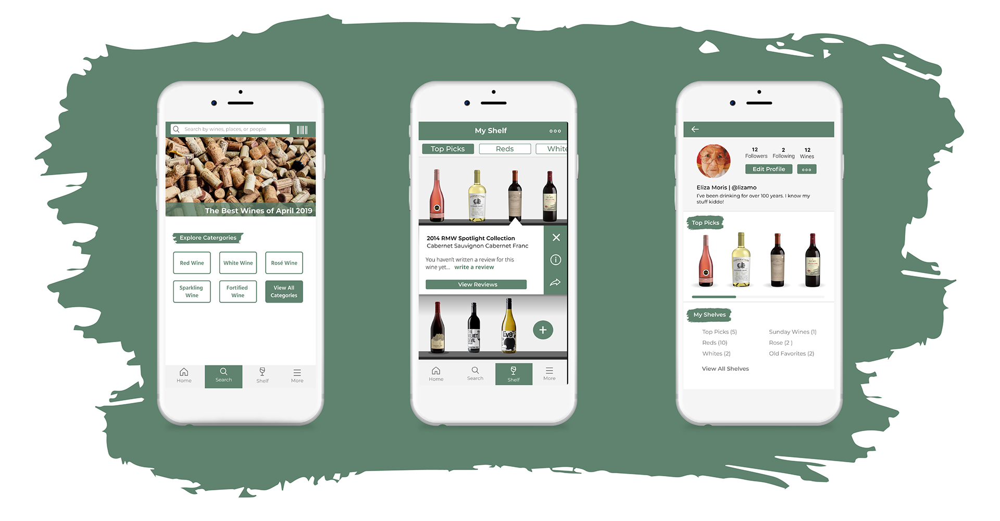
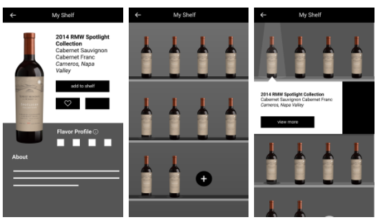
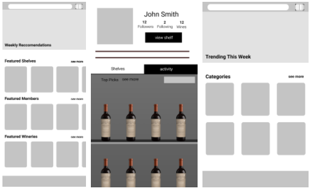
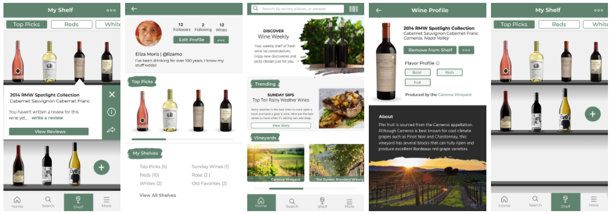

[back](./)

# My Wine Shelf

[My Wine Shelf Prototype](https://www.figma.com/proto/SL20C2hdwfmKyW3oeRBdPG73/Wine-Shelf?node-id=45%3A22&scaling=min-zoom&redirected=1)

## Problem and Purpose
Constellation Brands is company that manages 100s of alcohol brands, and everyday acquire new brands of alcohols to add to their collection. With all the brands they own, CB would like to gauge what their consumers like and possibly get insight on potentially trends, so they can acquire new brands to benefit their business.

For consumers, there is a lot of wine out there and that can be overwhelming to people who want to be adventurous and try new wine, or want something a little different than they’re used to. It can be difficult to find out what to try and not risk wasting money on wine you might not like.
These two problems creates an opportunity to connect with these curious drinkers with CB owned brands and with the careful inclusion of non-CB owned brands can allow CB to see what’s popular.

## The Process

### The Beginning
Before diving into the project, I conducted some preliminary research. I interview classmates and friends who drank wine, since I personally don’t drink, I needed insight on to what people would find important when choosing an alcohol that might interest them and how they themselves got recommendations.

​Most individuals I interviewed told me that they mainly chose a drink based on price and flavor, and they mainly received recommendations from friends and family, and occasionally from a drink expert. Everyone I asked said that they didn’t really explore options since it was overwhelming so they often stuck with what they know.

​This information lead me to condense the app to feature solely wine. Different alcohols have different characteristics that people look for, sticking to wine cuts down on the information feature in the app allowed me to explore more possibilities for exploring new wines. The interviews also helped me narrow down the important information for the wine drinkers look for and develop a list of features that would help the exploration process for curious drinkers.

### The Concept
Armed with my research and my goal in mind, I began brainstorming concepts for an app that would successfully solve the problems posed earlier, thus creating My Wine Shelf. Users would be able to add wines to their wine shelves, be it new wines to try or tried and true favorites. They would be able to share these wines with friends and write reviews on wines that other can view to form their own opinion.

​I primarily see this app being used to manage large collections of wines and find potential additions to a wine collection. People will potentially use this app to find new wines and connect with other people who wish to connect with other wine consumers.

​After completing the wireframes I made a few edits to the structure of a few of the screens, most notably the profile and home page. With the profile page, I added removed the smaller self and created more of highlight section. This allowed the page to breathe more and improved the function of the page as a quickview of the person's tastes and preferences. You don't need to see everything about the person right away.

## The Product
In the end, I created an app to help users discover wine that interests them through a novel interface them and also connect with Constellation Brands. Through the app Constellation Brands will be able to determine which wines their consumers like and dislike, which will allow the to acquire more brands that will seamlessly blend into their current catalog.

Through this project, I learned more about balancing the needs of stakeholders as well as that of the users. As much as I would love create projects solely for the needs of the user, I understand that the needs of business can be just as important.

If I were to redo this project, I would most likely change some of the visual elements and introduce an accent color. I would also explore what the structure of other screens would look like since I main focused on the userflow of adding a wine to a collection.

[back](./)